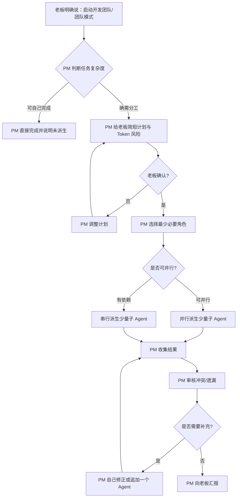

<!-- markdownlint-disable MD033 MD041 -->
<div align="center">


<br><br>

<h1>🏗️ Dev Team</h1>
<h3>AI 虚拟开发团队</h3>

<p>
  <b>老板明确启动 · PM 节制调度 · 多角色 AI Agent 按需协作</b><br>
  <sub>手动触发的 AI 软件团队工作流 —— 默认不自动进入团队模式，更省 Token</sub>
</p>

<br>

```
   👔 老板 (你)
     │
     ▼
   🔷 PM (主 Agent)
     │
     ├── 🎨 UI/UX Designer   → 设计规范 · 视觉风格 · 交互体验
     ├── ⚛️  Frontend Developer → 组件 · 状态 · 路由 · 性能
     ├── 🖥️  Backend Developer  → API · 数据库 · 业务逻辑 · 认证
     ├── 🔧 DevOps Engineer     → CI/CD · Docker · 部署
     ├── 🧪 QA Engineer         → 测试策略 · 集成测试
     └── 👀 Code Reviewer       → 架构审查 · 安全审计
```

</div>

<br>

---

## 📖 目录

- [⚠️ 平台支持](#-平台支持)
- [🤔 这是什么？](#-这是什么)
- [✨ 核心亮点](#-核心亮点)
- [🧪 Beta：手动触发低 Token 版](#-beta手动触发低-token-版)
- [🚀 快速开始](#-快速开始)
- [📦 安装](#-安装)
- [🎮 使用](#-使用)
- [🧠 工作机制透明说明](#-工作机制透明说明)
- [💰 Token 成本参考](#-token-成本参考)
- [📐 设计哲学](#-设计哲学)
- [📁 项目结构](#-项目结构)
- [🤝 贡献](#-贡献)
- [📄 许可](#-许可)
- [⭐ 致谢](#-致谢)

---

## ⚠️ 平台支持

> [!WARNING]
> **仅支持 Claude Code**（CLI · VS Code 扩展 · JetBrains 扩展）
>
> ❌ 不支持 Cursor / Windsurf / GitHub Copilot / Codex / Kiro / Trae / 其他 AI 编辑器
>
> **原因**：核心功能（派生子 Agent、角色分工、并行调度）依赖 Claude Code 独有的 **Agent 工具** 和 **Skill 工具**，其他平台尚不支持。

> [!TIP]
> 如果团队用其他编辑器，角色提示词模板可单独拿出来当系统指令使用（降级模式，无多 Agent 调度）。

---

## 🤔 这是什么？

**Dev Team** 是一个 Claude Code 技能（Skill），将单个 AI 对话升级为**多角色虚拟开发团队**。

传统模式下，你和一个 AI 对话，它什么都干——前端、后端、设计一把梭。但真实项目里，UI 设计、前端开发、后端逻辑是**不同的人**负责的，各有所长，各司其职。这个 Skill 就是把这个模式搬到了 AI 里。

> **每个角色都是独立的子 Agent**，拥有专属提示词和技能映射。PM 负责接令、拆解、调度、审核、整合，最后向你——老板汇报。

---

## ✨ 核心亮点

<table>
<tr>
  <td width="50%">

  ### 🎯 老板视角
  只管发号施令和审结果，不关心内部怎么调度。

  ### 🧠 智能调度
  PM 只在你明确说“启动开发团队 / 团队模式 / 组建团队”后调度角色。

  ### 🎨 专业分工
  每个子 Agent 有专属「大神级」提示词，不是换个名字。

  </td>
  <td width="50%">

  ### 🔌 技能映射
  自动关联 15+ 高质量社区 Skill（Vercel · Anthropic · mattpocock）

  ### ⚡ Token 更省
  默认不自动触发团队模式；简单活 PM 自己干，复杂活也先等你明确授权。

  ### 🛡️ 质量兜底
  PM 审核对齐所有输出，处理角色间冲突。

  </td>
</tr>
</table>

---

## 🧪 Beta：手动触发低 Token 版

> [!IMPORTANT]
> `v1.1.0-beta.1` 是**手动触发版**：Dev Team 只会在你明确说 `启动开发团队`、`团队模式`、`组建团队`、`用 dev-team` 或同义指令时启用。
>
> 即使任务看起来很复杂、涉及全栈/UI/前后端，Claude 也不应该自行进入团队模式；未明确要求时会按普通 Claude Code 流程处理，或先询问你是否要开团队。

### 和 1.0.1 的区别

| 项目 | 1.0.1 | 1.1.0-beta.1 |
|:---|:---|:---|
| 触发方式 | 可因复杂多角色任务自动触发 | 仅用户明确要求后触发 |
| 常驻描述 | 较完整，偏主动 | 更短，偏保守 |
| Skill 正文 | 角色模板较详细 | 精简为调度规则 + 短模板 |
| Token 策略 | 复杂任务可主动建议团队 | 默认主 Agent 自己做，必要时先问 |

### 推荐说法

```text
启动开发团队，先只给计划和 Token 风险评估，不要写代码。
```

```text
团队模式：帮我把这个功能按 UI、前端、后端拆开做，但最多派 2 个 Agent。
```

```text
你自己做，不要团队模式。
```

---

## 🚀 快速开始

```bash
# 1. 安装
npx skills add vnf123/dev-team@dev-team -g

# 2. 重启 Claude Code

# 3. 在 Claude Code 里说
> 启动开发团队，帮我搭一个用户管理后台
```

搞定了。只有这类明确指令会进入团队模式；否则默认由主 Agent 直接处理，避免误触发和额外 Token 消耗。

---

## 📦 安装

<details open>
<summary><b>方式一：npx skills（推荐）</b></summary>
<br>

```bash
npx skills add vnf123/dev-team@dev-team -g
```

一行命令，自动安装到 Claude Code。

</details>

<details>
<summary><b>方式二：手动安装</b></summary>
<br>

```bash
# 克隆仓库
git clone https://github.com/vnf123/dev-team.git

# 用户级安装（所有项目可用）
cp -r dev-team/.claude/skills/dev-team ~/.claude/skills/

# 项目级安装（仅当前项目）
cp -r dev-team/.claude/skills/dev-team 你的项目/.claude/skills/
```

</details>

<br>

> [!IMPORTANT]
> 安装后**重启 Claude Code** 才能生效。

---

## 🎮 使用

### 触发方式

| 指令 | 效果 |
|:-----|:-----|
| `启动开发团队` | 手动触发团队模式 |
| `团队模式` / `组建团队` / `用 dev-team` | 同上 |
| 未明确要求团队模式的复杂任务 | **不会自动触发**，按普通 Claude Code 流程处理或先询问 |

### 调度策略

<div align="center">

| 🟢 并行（一次发多个 Agent） | 🟡 串行（等上一个完成） |
|:---|:---|
| UI + Backend → 设计规范和 API 互不依赖 | UI → Frontend → 前端需设计输出 |
| Frontend × N → 多个独立页面/组件 | Backend → Frontend → 前端需 API 定义 |
| Backend + DevOps → 代码和部署配置并行 | PM 整合 → Reviewer → 审查在整合后 |

</div>

### 典型对话

> **👨‍💼 老板**
>
> 帮我搭一个用户管理后台，需要登录注册、用户列表、权限管理。前端用 React + shadcn，后端用 Spring Boot。

> **🤖 PM**
>
> 老板，我计划这样推进：
>
> - **并行**：UI Designer + Backend（设计规范和 API 设计互不依赖）
> - **串行**：Frontend（等 UI 和 API 就绪后开工）
>
> 需要 QA 做集成测试吗？

> **👨‍💼 老板**
>
> 先不加 QA，开始吧。

> **🤖 PM** — *几分钟后*
>
> 老板，完成了。以下是交付情况：
>
> | | |
> |---|---|
> | 📋 任务 | 用户管理后台（登录 / 注册 / 列表 / 权限） |
> | 👥 投入 | UI Designer + Backend + Frontend |
> | 📦 产出 | `design-system.md` · `UserController.java` · `AuthService.java` · `schema.sql` · `LoginPage.tsx` · `UserList.tsx` · `RoleGuard.tsx` |
> | 💡 决策 | 权限模型用了 RBAC，后续扩展更灵活 |

### 匹配策略

```
简单任务              →  PM 自己干，不提团队
复杂但未明确开团队      →  按普通 Claude Code 流程处理，必要时先询问
老板说「团队模式」      →  启用 Dev Team，再按成本最小原则派生
```

---

## 🧩 角色详情

<div align="center">

### 🎨 UI/UX Designer

| | |
|:---|:---|
| **何时启用** | 设计系统 · 视觉风格 · 组件规范 · 交互流程 |
| **关联技能** | `ui-ux-pro-max` · `web-design-guidelines` |
| **交付物** | 色彩方案 · 字体搭配 · 间距系统 · 布局描述 · 交互状态 · 可访问性要点 |

### ⚛️ Frontend Developer

| | |
|:---|:---|
| **何时启用** | React / Vue / Next.js 组件 · 状态管理 · 路由 · 性能优化 |
| **关联技能** | `vercel-react-best-practices` · `vercel-composition-patterns` · `next-best-practices` |
| **交付物** | 组件代码 · 状态管理 · 路由配置 · loading / empty / error 状态覆盖 |

### 🖥️ Backend Developer

| | |
|:---|:---|
| **何时启用** | API 设计 · 数据库 Schema · 业务逻辑 · 认证授权 |
| **关联技能** | `java-spring-boot` · `coding-standards` |
| **交付物** | API 定义（含请求/响应示例） · 数据库 DDL · 业务代码 · 认证方案 |

### 🔧 可选角色

| 角色 | 触发条件 | 关联技能 |
|:---|:---|:---|
| **DevOps Engineer** | CI/CD · Docker · K8s · 部署 | `devops-engineer` |
| **QA Engineer** | 复杂业务测试 · 全流程策略 | `tdd` · `breakdown-test` |
| **Code Reviewer** | 跨多文件改动 · 安全审查 | `requesting-code-review` · `improve-codebase-architecture` |

</div>

---

## 🧠 工作机制透明说明

Dev Team 的核心不是神秘黑盒，而是一套**提示词驱动的调度流程**。完整逻辑在 [`SKILL.md`](.claude/skills/dev-team/SKILL.md) 中，下面是 README 版透明说明。

### 1. 调度流程



### 2. 并发上限

| 任务类型 | 默认并发上限 | 说明 |
|:---|:---:|:---|
| 未明确启动团队 | 0 | 不使用本 Skill，按普通 Claude Code 流程处理 |
| 简单团队任务 | 0 | 已进入团队模式，但 PM 直接完成更省 Token |
| 轻量团队任务 | 1 | 只派最关键角色，如 UI 或 Backend |
| 常规跨领域任务 | 2 | 通常是 UI + Backend，或 Frontend + Backend |
| 复杂全栈任务 | 3 | 需要老板确认，且必须说明 Token 成本 |
| 超大任务 | 先拆阶段 | 4+ Agent 必须再次确认，不默认启用 |

> [!NOTE]
> 并发上限是 **提示词约束**，不是硬性 API 限制。PM 会按「是否真的提升质量」来决定是否派生。

### 3. 决策矩阵

| 问题 | 如果答案是「是」 | 动作 |
|:---|:---|:---|
| 老板是否明确说了启动开发团队/团队模式/组建团队？ | 否 | 不使用本 Skill |
| 已进入团队模式，但只改一个文件/一个小点？ | 是 | PM 自己做，并说明未派生 |
| 不派 Agent 会明显降低质量？ | 否 | PM 自己做 |
| 涉及 UI + 前端 + 后端且老板确认成本？ | 是 | 最多 2-3 个角色，分阶段推进 |
| 前端依赖设计稿或 API？ | 是 | 串行：UI/Backend → Frontend |
| UI 和后端互不依赖？ | 是 | 可并行：UI + Backend |
| 需要部署/CI/CD？ | 是 | 加 DevOps |
| 业务规则复杂且容易漏测？ | 是 | 加 QA |
| 老板要求审查或改动风险高？ | 是 | 加 Reviewer |

### 4. 异常处理

| 异常 | PM 处理方式 |
|:---|:---|
| 子 Agent 输出冲突 | PM 以老板需求为准统一字段、接口、文件路径 |
| 子 Agent 输出太泛 | PM 收缩范围，追加更明确的问题或自行修正 |
| 子 Agent 漏了边界情况 | PM 补充 loading / empty / error / 权限 / 失败场景 |
| 角色间依赖不完整 | PM 先补齐上游输出，再让下游继续 |
| Token 消耗过高 | PM 停止继续派生，改为自己整合 |
| 需求不清晰 | PM 向老板提 1-3 个关键问题，不无限追问 |

### 5. 冲突处理优先级

当多个 Agent 给出不同方案时，PM 按以下优先级决策：

1. **老板明确要求**
2. **现有项目约定**（代码风格、目录结构、技术栈）
3. **可维护性和一致性**
4. **性能与安全**
5. **实现成本**

---

## 💰 Token 成本参考

多 Agent 的好处是并行和专业分工，代价是 Token 增加。Beta 版默认不自动触发团队模式，目的是把这部分成本变成用户明确授权的成本。下面是经验参考，实际消耗会随项目大小、上下文长度、文件数量变化。

> [!WARNING]
> 这不是精确计费表，只是帮助你预估「要不要开团队」。如果担心成本，请先让 PM 输出计划，不要直接让它全量实现。

| 模式 | Agent 数 | 适用任务 | 预计 Token 倍数 | 建议 |
|:---|:---:|:---|:---:|:---|
| PM 单人 | 0 | 小改动、单文件、明确 bug | 1x | 默认优先 |
| 轻量团队 | 1 | 只需一个专家视角，如 UI 设计或后端 API | 1.5x - 2x | 推荐用于中等任务 |
| 标准团队 | 2 | UI + Backend、Frontend + Backend | 2x - 3.5x | 全栈功能常用 |
| 完整团队 | 3 | UI + Backend + Frontend / QA | 3x - 5x | 复杂功能再用 |
| 扩展团队 | 4+ | 加 DevOps、Reviewer、QA 全套 | 5x+ | 谨慎，建议分阶段 |

### 成本控制建议

- 只有当你明确说 **`启动开发团队` / `团队模式` / `组建团队` / `用 dev-team`** 时才开团队。
- 先说：**「先出计划，不要实现」**，让 PM 给出角色分工和成本预估。
- 对复杂任务分阶段：设计 → 后端 → 前端 → 测试，不要一次全开。
- 不确定时让 PM 使用「轻量团队」：只派一个最关键 Agent。
- 明确禁止项：**「不要开 QA / 不要开 DevOps / 不要代码审查」**。
- 如果只是小修小补，直接说：**「你自己做，不要团队模式」**。

### 推荐指令

```text
老板模式：启动开发团队，但先只给计划和 Token 风险评估，不要写代码。
```

```text
轻量模式：只派 UI Designer，其他你自己整合。
```

```text
省钱模式：你自己完成，不要派生子 Agent。
```


<blockquote>

#### 🤷 为什么不是"一个 AI 全干"？

一个 AI 全干的问题是**上下文噪音** — 写后端逻辑时不会被前端框架细节分心，做 UI 设计时不会被数据库 Schema 干扰。真实团队按角色分工不是没道理的。

#### 💰 Token 精简原则

> **不派生这个 Agent，最终交付质量会明显下降吗？**

- 修个按钮样式 → **NO** → PM 自己做
- 重构整个权限系统 → **YES** → 启动团队

#### 🛡️ PM 兜底机制

子 Agent 的输出可能存在冲突（比如前后端用了不同的字段名），PM 负责：

- 审核每个 Agent 的产出
- 对齐接口和数据格式
- 合并统一文件结构
- 处理遗漏和边缘情况
- 向老板做清晰汇报

</blockquote>

---

## 📁 项目结构

```
dev-team/
├── README.md
├── LICENSE
├── CHANGELOG.md
├── CONTRIBUTING.md
├── CODE_OF_CONDUCT.md
├── skill.json
├── .gitignore
├── .github/
│   └── ISSUE_TEMPLATE/
│       ├── bug_report.md
│       └── feature_request.md
└── .claude/
    └── skills/
        └── dev-team/
            └── SKILL.md          ← 🔑 技能核心文件
```

---

## 🤝 贡献

欢迎提 Issue 和 PR！详见 [CONTRIBUTING.md](CONTRIBUTING.md)

| 🐛 | ✨ | 📝 | 🔌 | 📖 |
|:--|:--|:--|:--|:--|
| 修复角色提示词 | 新增角色 | 优化提示词模板 | 集成更多 Skill | 补充文档 |

---

## 📄 许可

<p align="center">
  MIT License · © 2025 <a href="https://github.com/vnf123">vnf123</a>
</p>

---

## ⭐ 致谢

本 Skill 集成了以下优秀社区技能（需提前安装）：

<div align="center">

| 技能 | 作者 | 安装量 |
|:---|:---|:---|
| `vercel-react-best-practices` | Vercel | 440K |
| `web-design-guidelines` | Vercel | 355K |
| `vercel-composition-patterns` | Vercel | 194K |
| `ui-ux-pro-max` | NextLevelBuilder | 192K |
| `tdd` | mattpocock | 183K |
| `requesting-code-review` | obra | 107K |
| `java-spring-boot` | pluginagentmp | 10.9K |
| `devops-engineer` | jeffallan | 5.5K |

</div>

<br>

---

<p align="center">
  <sub>Built with ❤️ for the AI coding community</sub>
  <br><br>
  <a href="https://github.com/vnf123/dev-team/stargazers">⭐ Star</a> ·
  <a href="https://github.com/vnf123/dev-team/issues">🐛 Report Bug</a> ·
  <a href="https://github.com/vnf123/dev-team/issues">✨ Request Feature</a>
</p>
